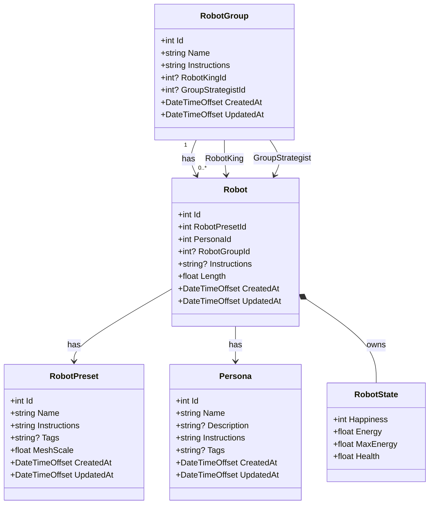

```mermaid
classDiagram
    class RobotGroup {
        +int Id
        +string Name
        +string Instructions
        +int? RobotKingId
        +int? GroupStrategistId
        +DateTimeOffset CreatedAt
        +DateTimeOffset UpdatedAt
    }
    class RobotPreset {
        +int Id
        +string Name
        +string Instructions
        +string? Tags
        +float MeshScale
        +DateTimeOffset CreatedAt
        +DateTimeOffset UpdatedAt
    }
    class Persona {
        +int Id
        +string Name
        +string? Description
        +string Instructions
        +string? Tags
        +DateTimeOffset CreatedAt
        +DateTimeOffset UpdatedAt
    }
    class RobotState {
        +int Happiness
        +float Energy
        +float MaxEnergy
        +float Health
    }
    class Robot {
        +int Id
        +int RobotPresetId
        +int PersonaId
        +int? RobotGroupId
        +string? Instructions
        +float Length
        +DateTimeOffset CreatedAt
        +DateTimeOffset UpdatedAt
    }

    RobotGroup "1" --> "0..*" Robot : has
    RobotGroup --> Robot : RobotKing
    RobotGroup --> Robot : GroupStrategist
    Robot --> RobotPreset : has
    Robot --> Persona : has
    Robot *-- RobotState : owns
```